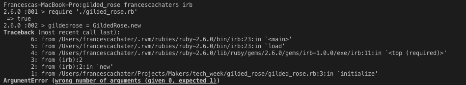
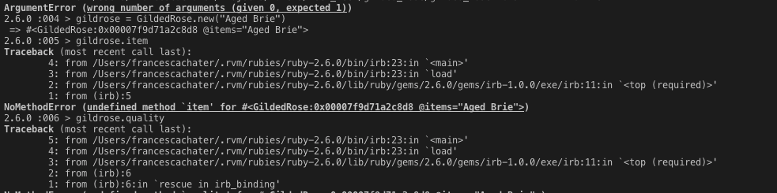
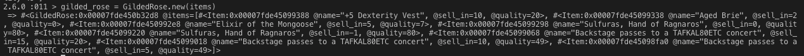
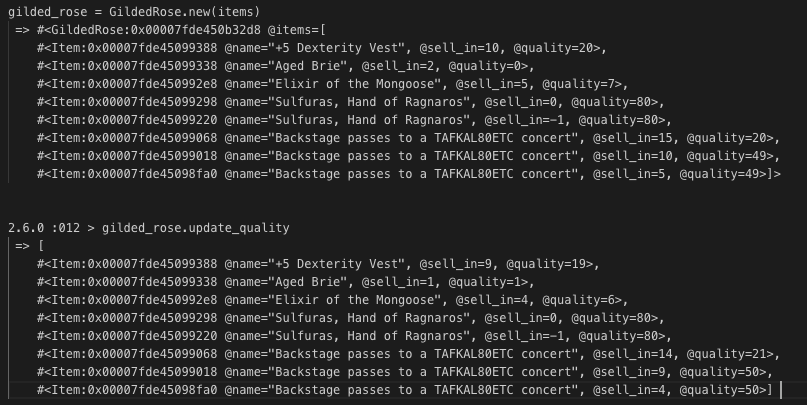

# My Approach

I planned what I wanted to do in 25 minute blocks, taking 5 minutes afterwards to reflect on what I had acheived and plan what to do in the next block.

### DAY ONE

11-11:30.am || 25 mins || Plan
* Folder setup.
* Check RSpec is working.
* Install linter and Simplecov.
* Come back to planning.

Reflection
* Spent long time trying to read spec and work out how to only clone one folder (svn export  GildedRose-Refactoring-Kata/trunk/ruby)
* Only setting up folders now. (also v nervous about review).

11:30am || 25 mins || Plan
* Will now do what I set out to do in first section.
* Folders in a mix, created spec folder. Ran RSPec but errors outside 
* Created unit / feature folders in spec. Still not sure what’s going on - going back to criteria. 

12:00 Process Review.

1pm || 25 mins || Plan
* Get the green light in RSpec - still can’t locate file. Going back to previous project to see where this line of code was used before.
* Moved `require File.join(File.dirname(__FILE__), ‘gilded_rose.rb’)` to spec_helper.rb
* Come back to planning

Reflection
* Restarting with Ruby file as tests are all meant to be passing on startup.
* Started again, got green tests!
* Tried Bundle install, no gem file.
* Trying to git add copied folders, get below error message. Google says it’s problem with class. 
```
git add .
fatal: CRLF would be replaced by LF in .buildpath` 
```

14:07 || 25 mins || Plan
* Read through criteria
* Read through methods
* Play in IRB to see how programme works.

Reflection

What is a legacy code ?
Legacy code refers to an application system source code type that is no longer supported. Legacy code can also refer to unsupported operating systems, hardware and formats. In most cases, legacy code is converted to a modern software language and platform. However, to retain familiar user functionality, legacy code is sometimes carried into new environments.

[Why Most Solutions to Gilded Rose Miss The Bigger Picture](http://iamnotmyself.com/2012/12/07/why-most-solutions-to-gilded-rose-miss-the-bigger-picture/)
> Now I realise that katas are meant to be simple problem solving exercises that allow you to practice your skills. But I would suggest that one of the skills you should be practicing is entering an unfamiliar environment and being productive quickly. I would like to challenge the kata community to attempt the original kata. See what it is like to live in somebody else’s shoes and be productive.
> 
[Writing Good Tests for the Gilded Rose Kata](http://coding-is-like-cooking.info/2013/03/writing-good-tests-for-the-gilded-rose-kata/) 

* So the first part of the Kata is to add automated tests to the existing code. 
* You’ve got a requirements document the customer has given you, and you can use it to identify test cases. 
* You’ve also got the code which you can read and execute and work out what it does. 
* The customer is happily using the code in production right now, so you can assume that the behaviour it has is the behaviour they want to keep, whatever it says in the requirements document. 
[requirements document](https://github.com/emilybache/Refactoring-Katas/blob/master/GildedRose/GildedRoseRequirements.txt)

*Implementing my code*
* Looking at code, there are two classes. Gilded Rose and Item. Unsure about spec file so adding test feature test. 
* Tried adding test but RSpec not picking it up.

14:33 - What have I done?
* Read through all files, now have a much clearer understanding of what I’m looking at. On reflection from morning, I was too nervous about review to read through it calmly. This requires a very different approach to the previous Bank test.
* Implemented first test, programme not responding to it. 
---
*14: 36 || Plan for next 25 mins*
* Run programme in IRB to see what’s happening
* Potentially remove one of the test files - read about Text-based Approval Testing 
* Main aim is to get programme to respond to a test I build

*What I've Done*

 To understand programme better, running in IRB. Getting a lot of errors - going back to criteria to read about text tests.
 

* Specification seems to say it is more convenient to test with TextTest however as I’m totally unfamiliar with it and want to get into the coding, I’m going to use RSpec. I’ve hidden the tests.rb file for now.
* Created a gemfile, adding rspec. `Bundle install`. 
---
15:04 *Plan for next 25 mins*
* Get first test reacting, hide text_test file.
* RSpec innit - can I do that if one is already in place?

*What I’ve done* 
* `rspec —-init`
*  (File.join(File.dirname(__FILE__), ‘gilded_rose’) is about path directory) so in _spec, changed `require File.join(File.dirname(__FILE__), ‘gilded_rose’`  -> `require ‘./gilded_rose’`. Tests now successfully failing! 
* Created lib folder and removed test test.
* Write first test 
items = [
  Item.new(name=“+5 Dexterity Vest”, sell_in=10, quality=20) 
  Item.new(name=“Aged Brie”, sell_in=2, quality=0),
  Item.new(name=“Elixir of the Mongoose”, sell_in=5, quality=7),
  Item.new(name=“Sulfuras, Hand of Ragnaros”, sell_in=0, quality=80),
  Item.new(name=“Sulfuras, Hand of Ragnaros”, sell_in=-1, quality=80),
  Item.new(name=“Backstage passes to a TAFKAL80ETC concert”, sell_in=15, quality=20),
  Item.new(name=“Backstage passes to a TAFKAL80ETC concert”, sell_in=10, quality=49),
  Item.new(name=“Backstage passes to a TAFKAL80ETC concert”, sell_in=5, quality=49)
]

*Reflection - What Have I done?*
* Got to grips with programme in IRB
```
> require './lib/gilded_rose.rb'

> items = [
2.6.0 :003 >       Item.new(name="+5 Dexterity Vest", sell_in=10, quality=20),
2.6.0 :004 >       Item.new(name="Aged Brie", sell_in=2, quality=0),

2.6.0 :005 >       Item.new(name="Elixir of the Mongoose", sell_in=5, quality=7),
2.6.0 :006 >       Item.new(name="Sulfuras, Hand of Ragnaros", sell_in=0, quality=80),
2.6.0 :007 >       Item.new(name="Sulfuras, Hand of Ragnaros", sell_in=-1, quality=80),
2.6.0 :008 >       Item.new(name="Backstage passes to a TAFKAL80ETC concert", sell_in=15, quality=20),
2.6.0 :009 >       Item.new(name="Backstage passes to a TAFKAL80ETC concert", sell_in=10, quality=49),
2.6.0 :010 >       Item.new(name="Backstage passes to a TAFKAL80ETC concert", sell_in=5, quality=49)]

> gilded_rose = GildedRose.new(items)
```



---
*15:35 | | Plan for next 25 mins* 

* Write first feature test with new thing they want implemented
* Create spec_helpers for items listed above, creating a new gild rose with items. 
* If I finish that, see if I can write a test for the current methods.

*What I’ve done*
* `> gilded_rose.update_quality` and saw the difference between the items to help visualise. 
2019-07-02 at 15.40.58.png]
* Created spec_helpers for `create item list` and `create_gildedRose_with_items`  to use with testing.
* Created `item_spec.rb`
* Created first unit test for Item, now going to separate classes and check test still works. Ran RSpec, all good!
* Quick check and still getting this error message when trying to add to Github `fatal: CRLF would be replaced by LF in .buildpath`. Have googled, seem to be able to run `git config --global core.autocrlf false` but have asked coach for help.
* Passed second feature test covering item class.
* Added Simplecov - got test coverage currently at 100%
* Asked second coach re GitHub help. 
---
*16:37 | ^ Finish ^  | Reflection* 
* Going to stop there as I want to be add any future additions to Github which I can’t do at the moment. 
* Separated the classes and wrote feature tests so feel I have a good understanding of how to set up a series to tests in order to not break the current code. 
* Nerves for code review meant I couldn’t focus on the task in the morning and I tried to dive in before reading the spec which was a mistake. 


*Notes for later* 
* Add to README [Better Code Hub](https://bettercodehub.com/pricing)

### DAY TWO

25 mins || Plan
* Move Item class back into same page as gildedrose for simplicity, separate later after all tests are passing.
* Write unit tests for gildedrose

What Have I Done?
* Mocked item to test gilded rose
* Written first main tests from spec for GildedRose, including: 
- All items have a SellIn value which denotes the number of days we have to sell the item
	- All items have a Quality value which denotes how valuable the item is
	- At the end of each day our system lowers both values for every item
* All tests currently passing
* Committed tests

25 mins || Plan
* Continue writing tests, adding specific elements for aged brie etc.

What have I done?
* Implemented all these tests: 
	- XX Once the sell by date has passed, Quality degrades twice as fast
	- XX The Quality of an item is never negative
	- XX "Aged Brie" actually increases in Quality the older it gets
	- XX The Quality of an item is never more than 50
	- XX "Sulfuras", being a legendary item, never has to be sold or decreases in Quality

25 mins || Plan
* Finish writing tests - will get done in next 25 mins. Probably in 10 minutes.
* Write test for congured item which subsequently needs to be fixed in code - come back to this later. Test will take a few minutes to write.
* Start modelling - need to think about what kind of model. Class model of how everything will work? Google ideas for solution incase there's something better. Don't change any code in class in this time.

What have I done?


